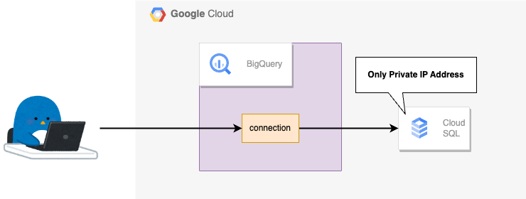
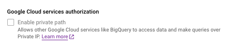

# Hands On Private Path of Cloud SQL

## 概要

Cloud SQL の Private Path を試すハンズオンです

Cloud SQL にパブリック IP アドレスを持たせること無く、 BigQuery から連携クエリ( Federated queries )が実行可能なので、Google Cloud のセキュリティの向上に繋がります :lock:



Cloud Console では Google Cloud services authorization( Google Cloud サービスの承認 )とも表示されています



### 注意事項

記載の情報は執筆当時の情報になります
## ハンズオン

## 0. 準備

```
export _gc_pj_id='Your Google Cloud Project ID'

export _common='hnd-sql-pripath'
export _region='asia-northeast1'
export _sub_network_range='172.16.0.0/12'
```

+ Google Cloud と認証をします

```
gcloud auth login --no-launch-browser
```

+ API の有効化
  + ※ 他の API の有効化も必要になったタイミングで実施してください

```
### BigQuery Connection API
gcloud beta services enable bigqueryconnection.googleapis.com --project ${_gc_pj_id}
```

## 1. Cloud SQL の準備

こちらを参考に作成していきます

https://github.com/iganari/package-gcp/tree/main/sql/feature-only-private-ip-addr

+ VPC Network の作成します

```
gcloud beta compute networks create ${_common}-network \
  --subnet-mode=custom \
  --project ${_gc_pj_id}
```

+ private services connection の作成します

```
gcloud beta compute addresses create google-managed-services-${_common}-network \
  --global \
  --purpose VPC_PEERING \
  --prefix-length 16 \
  --network=projects/${_gc_pj_id}/global/networks/${_common}-network \
  --project ${_gc_pj_id}
```

+ private connection の作成します

```
gcloud services vpc-peerings connect \
  --service servicenetworking.googleapis.com \
  --ranges google-managed-services-${_common}-network \
  --network ${_common}-network \
  --project ${_gc_pj_id}
```

+ Cloud SQL Instance の作成します
  + `--enable-google-private-path` をつけます

```
export _date=`date +"%Y%m%d%H%M"`

export _database_ver='MYSQL_8_0'
export _machine_type='db-g1-small'
export _sql_instance_name=$(echo ${_common}-${_date})
```
```
gcloud beta sql instances create ${_sql_instance_name} \
  --database-version ${_database_ver} \
  --region ${_region} \
  --tier ${_machine_type} \
  --storage-size 10G \
  --storage-auto-increase \
  --network=projects/${_gc_pj_id}/global/networks/${_common}-network \
  --no-assign-ip \
  --enable-google-private-path \
  --project ${_gc_pj_id}
```

+ Cloud SQL Instance 内に database とユーザを作成します

```
gcloud beta sql databases create ${_common} \
  --instance ${_sql_instance_name} \
  --charset utf8 \
  --collation utf8_general_ci \
  --project ${_gc_pj_id}
```

+ ユーザの作成( 組み込み認証を使用 )します

```
gcloud sql users create iganari \
  --host="%" \
  --instance ${_sql_instance_name} \
  --password ${_gc_pj_id} \
  --project ${_gc_pj_id}
```

+ Cloud SQL にダミーデータをいれます
  + https://github.com/iganari/package-gcp/tree/main/sql/samples-dummydata

```
cd /tmp
wget https://downloads.mysql.com/docs/world-db.zip
wget https://downloads.mysql.com/docs/world_x-db.zip

unzip world-db.zip
unzip world_x-db.zip
```

+ Google Cloud Storage の Bucket を作成します

```
gcloud storage buckets create gs://${_gc_pj_id}-${_common} \
  --default-storage-class standard \
  --location ${_region} \
  --project ${_gc_pj_id}
```

+ Google Cloud Storage にアップロードします

```
gcloud storage cp world-db/world.sql gs://${_gc_pj_id}-${_common}/
gcloud storage cp world_x-db/world_x.sql gs://${_gc_pj_id}-${_common}/
```

+ Cloud SQL Instance の Service Account の Role を設定します

```
gcloud sql instances describe ${_sql_instance_name} --project ${_gc_pj_id} --format json | jq -r .serviceAccountEmailAddress

### 変数に入れる
export _sql_instance_sa="$(gcloud sql instances describe ${_sql_instance_name} --project ${_gc_pj_id} --format json | jq -r .serviceAccountEmailAddress)"
```

+ Cloud SQL Instance が Cloud Storage を読めるように Role を付与します

```
gcloud beta projects add-iam-policy-binding ${_gc_pj_id} \
  --member="serviceAccount:${_sql_instance_sa}" \
  --role="roles/storage.objectViewer"
```

+ 反映まで少し待ちましょう :coffee:

```
sleep 60s
```

+ Cloud Storage から Cloud SQL Instance にサンプルデータを挿入( Import )します

```
### world.sql
gcloud beta sql import sql ${_sql_instance_name} gs://${_gc_pj_id}-${_common}/world.sql --project ${_gc_pj_id} --quiet

### world_x.sql
gcloud beta sql import sql ${_sql_instance_name} gs://${_gc_pj_id}-${_common}/world_x.sql --project ${_gc_pj_id} --quiet
```

---> これで Cloud SQL にデータが入った状態になりました :)


+ 確認する場合は下記のコマンドで Cloud SQL に接続しましょう

```
gcloud sql connect ${_sql_instance_name} \
  --user iganari \
  --project ${_gc_pj_id}
```

## 2. BigQuery から Cloud SQL に繋げる

+ Cloud SQL へのコネクション( Connections )を作ります
  + https://cloud.google.com/bigquery/docs/connect-to-sql?hl=en#bq

```
export _federated_queries_connection_id="${_common}-con-id"
```
```
### world 用
echo '' > world.sh

cat << __EOF__ >> world.sh
bq mk --connection \
  --display_name='friendly name' \
  --connection_type='CLOUD_SQL' \
  --properties='{"instanceId":"${_gc_pj_id}:${_region}:${_sql_instance_name}", "database":"world", "type":"MYSQL"}' \
  --connection_credential='{"username":"iganari", "password":"${_gc_pj_id}"}' \
  --project_id ${_gc_pj_id} \
  --location ${_region} \
  ${_common}-con-id-world
__EOF__

### 確認
cat world.sh

### 実行
bash -x world.sh
```
```
### world_x 用
echo '' > world_x.sh

cat << __EOF__ >> world_x.sh
bq mk --connection \
  --display_name='friendly name' \
  --connection_type='CLOUD_SQL' \
  --properties='{"instanceId":"${_gc_pj_id}:${_region}:${_sql_instance_name}", "database":"world_x", "type":"MYSQL"}' \
  --connection_credential='{"username":"iganari", "password":"${_gc_pj_id}"}' \
  --project_id ${_gc_pj_id} \
  --location ${_region} \
  ${_common}-con-id-world-x
__EOF__

### 確認
cat world_x.sh

### 実行
bash -x world_x.sh
```

+ コネクション( Connections )を確認します
  + https://cloud.google.com/bigquery/docs/working-with-connections?hl=en#bq

```
### プロジェクト内のすべての連携を出す

bq ls --connection \
  --project_id ${_gc_pj_id} \
  --location ${_region} \
  --format json | jq .
```

+ 今回作成したコネクション( Connections )の詳細を表示します

```
### world
bq show --connection \
  --project_id ${_gc_pj_id} \
  --location ${_region} \
  --format json \
  ${_common}-con-id-world \
  | jq .

### world_x
bq show --connection \
  --project_id ${_gc_pj_id} \
  --location ${_region} \
  --format json \
  ${_common}-con-id-world-x \
  | jq .
```

+ 今回作成した接続のサービスアカウントに Cloud SQL への接続できる Role を付与します
  + おそらく同じサービスアカウントですが、念の為両方やりましょう

```
export _federated_queries_connection_sa_world="$(
  bq show --connection \
    --project_id ${_gc_pj_id} \
    --location ${_region} \
    --format json \
    ${_common}-con-id-world \
    | jq .cloudSql.serviceAccountId -r \
  )"

echo ${_federated_queries_connection_sa_world}
```
```
gcloud beta projects add-iam-policy-binding ${_gc_pj_id} \
  --member="serviceAccount:${_federated_queries_connection_sa_world}" \
  --role="roles/cloudsql.client"
```
```
export _federated_queries_connection_sa_world_x="$(
  bq show --connection \
    --project_id ${_gc_pj_id} \
    --location ${_region} \
    --format json \
    ${_common}-con-id-world-x \
    | jq .cloudSql.serviceAccountId -r \
  )"

echo ${_federated_queries_connection_sa_world_x}
```
```
gcloud beta projects add-iam-policy-binding ${_gc_pj_id} \
  --member="serviceAccount:${_federated_queries_connection_sa_world_x}" \
  --role="roles/cloudsql.client"
```

+ クエリを実行してみます
  + 一番ベーシックな **INFORMATION_SCHEMA** を実行します

```
### world
echo '' > query.sh

cat << __EOF__ >> query.sh
bq query \
  --project_id ${_gc_pj_id} \
  --use_legacy_sql=false \
  'SELECT * FROM EXTERNAL_QUERY("${_gc_pj_id}.${_region}.${_common}-con-id-world", "SELECT * FROM INFORMATION_SCHEMA.TABLES;");'
__EOF__

cat query.sh
bash -x query.sh
```
```
### world_x

echo '' > query.sh

cat << __EOF__ >> query_x.sh
bq query \
  --project_id ${_gc_pj_id} \
  --use_legacy_sql=false \
  'SELECT * FROM EXTERNAL_QUERY("${_gc_pj_id}.${_region}.${_common}-con-id-world-x", "SELECT * FROM INFORMATION_SCHEMA.TABLES;");'
__EOF__

cat query_x.sh
bash -x query_x.sh
```

---> 対象の DataBase の INFORMATION_SCHEMA の情報が取得・表示出来れば、今回のハンズオンは成功です :)

## 99 クリーンアップ

ハンズオン終了後は不要なリソースは削除しましょう ;)

<details>
<summary>連携の削除</summary>

+ 連携

```
### world
bq rm --connection --project_id ${_gc_pj_id} ${_gc_pj_id}.${_region}.${_common}-con-id-world

### world_x
bq rm --connection --project_id ${_gc_pj_id} ${_gc_pj_id}.${_region}.${_common}-con-id-world-x
```

</details>

<details>
<summary>Cloud SQL Instance の削除</summary>

```
gcloud beta sql instances delete ${_sql_instance_name} --project ${_gc_pj_id} --quiet
```

</details>

<details>
<summary>private services connection の削除</summary>

```
gcloud beta compute addresses delete google-managed-services-${_common}-network \
  --global \
  --project ${_gc_pj_id}
```

</details>

<details>
<summary>private connection の削除</summary>

:warning: CLI だと出来なかったので要検証

```
gcloud services vpc-peerings delete \
  --service servicenetworking.googleapis.com \
  --network ${_common}-network \
  --project ${_gc_pj_id}
```

</details>

<details>
<summary>VPC Network の削除</summary>

```
gcloud beta compute networks delete ${_common}-network --project ${_gc_pj_id} --quiet
```

</details>
